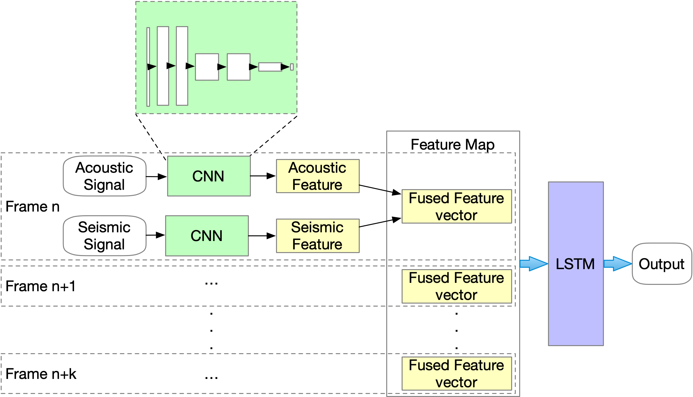
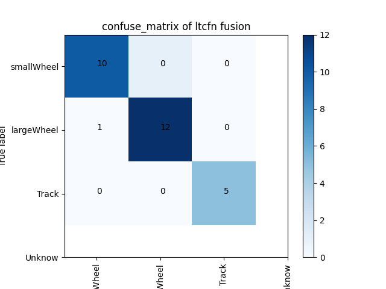

# Long-Term-Correlation-Feature-Network
LTCFN
是使用帧间特征进行一维声震同步信号进行融合分类的方法，同时还包括了部分比较方法如MFCC，Wavelet，CNN的Pytorch实现。借助[训练工具](https://github.com/Seafood-SIMIT/snake_spear_with_102_inch-A_DL_Trainer).

## 论文
论文链接：https://ieeexplore.ieee.org/document/10093799

    @ARTICLE{10093799,
    author={Sun, Lin and Zhang, Zebin and Tang, Hongying and Liu, Huawei and Li, Baoqing},
    journal={IEEE Sensors Journal}, 
    title={Vehicle Acoustic and Seismic Synchronization Signal Classification Using Long-Term Features}, 
    year={2023},
    volume={23},
    number={10},
    pages={10871-10878},
    doi={10.1109/JSEN.2023.3263572}}

## 结果介绍

